# Roadway-Graph Descriptive Report Draft

**Status: DRAFT FOR REVIEW.** This draft uses accepted descriptive roadway-graph outputs and aggregate AADT-normalized prototype summaries only. Unit-level rates remain QA-only and are not included as stakeholder-facing unit-rate tables or figures. This draft does not include fixed distance-band rates, raw bin-level rates, models, regressions, predictions, causal claims, design recommendations, or final downstream functional area distance recommendations.

## 1. Executive Summary

The current roadway-graph descriptive package summarizes a stable 0-2,500 ft roadway-derived directional-bin universe around TRUE reference signals. The accepted universe contains 110,710 directional bins, 13,216 assigned crashes, and 971 reference signals.

The 0-1,000 ft window is the high-priority descriptive window, with 9,170 assigned crashes. The 1,000-2,500 ft window is the sensitivity descriptive window, with 4,046 assigned crashes. Rows beyond 2,500 ft are excluded from the current descriptive report stage and remain review-only.

Crash direction fields were not read or used. Context fields enrich the accepted directional bins but do not define upstream or downstream.

The first descriptive AADT-normalized crash-rate prototype has completed unit-rate review. Only aggregate window-level and direction-level summaries are included here. All 2,967 unit-level rate rows remain QA-only and are not included as stakeholder unit-rate displays.

| Metric                          | Value   | Scope                                              |
| ------------------------------- | ------- | -------------------------------------------------- |
| total_directional_bins          | 110,710 | accepted 0-2500ft directional-bin universe         |
| assigned_crashes                | 13,216  | accepted assigned-crash universe                   |
| reference_signals               | 971     | TRUE reference signals represented in review queue |
| signal_direction_profile_rows   | 1,942   | reference_signal_id + signal_relative_direction    |
| highest_review_priority_signals | 14      | review priority only                               |
| high_review_priority_signals    | 141     | review priority only                               |
| stable_speed_bins               | 84,857  | accepted 0-2500ft directional-bin universe         |
| stable_aadt_bins                | 106,210 | accepted 0-2500ft directional-bin universe         |
| urban_assigned_crashes          | 11,915  | crash-level AREA_TYPE context                      |
| rural_assigned_crashes          | 1,301   | crash-level AREA_TYPE context                      |

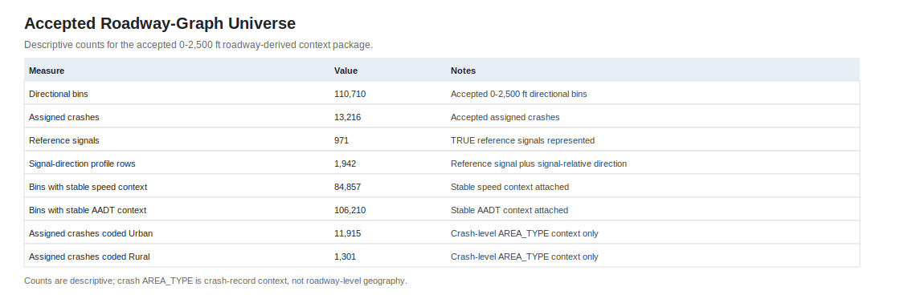

*Exhibit EX01. Accepted descriptive universe summary. Counts are descriptive and are not normalized by exposure.*

## 2. Background and Purpose

This draft reports the current roadway-derived descriptive package. It is intentionally narrower than a full guidance report and is intended to support review of the accepted table package and first figure set.

The restored signal-centered report material under `docs/reports/signal_centered/` is used only as a style and structure reference. The active method here is roadway-graph based.

## 3. Methodology Overview

The active workflow builds the roadway scaffold first, then adds crashes and context. The method starts from the Travelway graph, associates signals, gates TRUE reference signals, builds signal-to-anchor directional segments and bins, preserves divided and undivided roadway representation, assigns crashes conservatively, and then joins access, speed v4, AADT v3, and crash-level AREA_TYPE context.

Upstream and downstream are roadway-derived signal-relative classifications. Crash direction fields are not part of this report stage.

For methodology detail, see `roadway_graph_methodology_limitations_memo.md`. For denominator assumptions, see `../../design/roadway_graph_rate_denominator_policy.md` and `../../design/roadway_graph_rate_assumption_approval_v1.md`. Regression/modeling methods are not included here.

## 4. Accepted Directional-Bin Universe

The accepted universe is limited to 0-2,500 ft. The 0-1,000 ft window is the main descriptive focus. The 1,000-2,500 ft window is retained as sensitivity context.

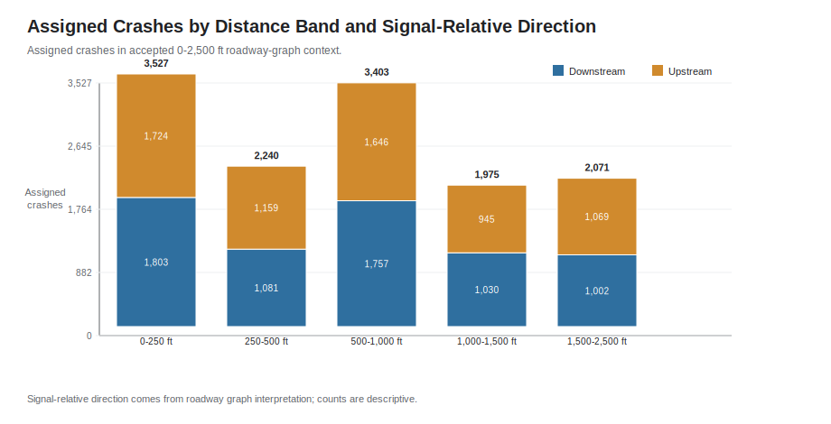

*Exhibit EX02. Assigned crash counts by fixed distance band and signal-relative direction. Signal-relative direction comes from roadway graph interpretation; crash direction fields are not used. These are assigned-crash counts only and are not rates.*

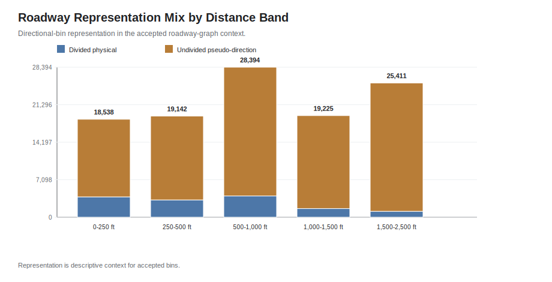

*Exhibit EX12. Roadway representation mix by distance band. Representation is context for the accepted bins.*

## 5. Context Enrichment Layers

The report uses accepted context joins only. Access, speed, AADT, and crash-level AREA_TYPE are descriptive context layers attached to accepted bins. They do not redefine upstream/downstream.

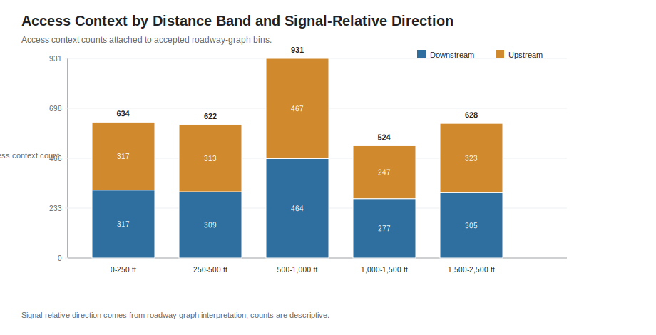

*Exhibit EX07. Access context counts by distance band and signal-relative direction. Access context is descriptive and does not establish a design distance.*

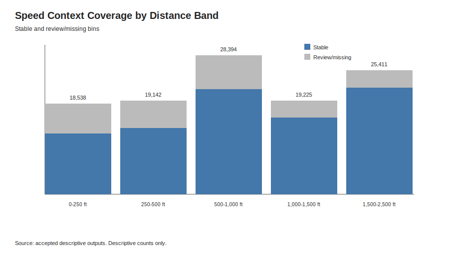

*Exhibit EX08. Speed context coverage by distance band. Missing and review statuses remain visible.*

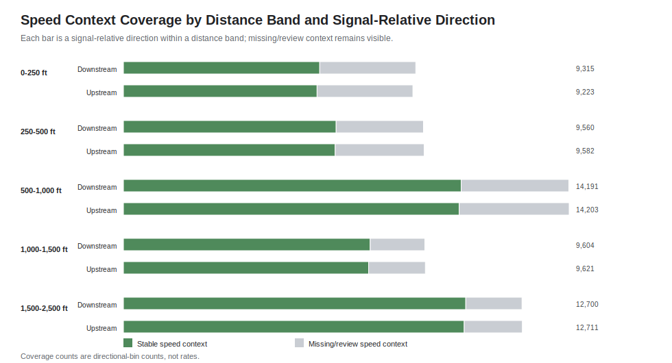

*Exhibit EX08B. Speed context coverage by distance band and signal-relative direction. Missing/review speed context remains visible.*

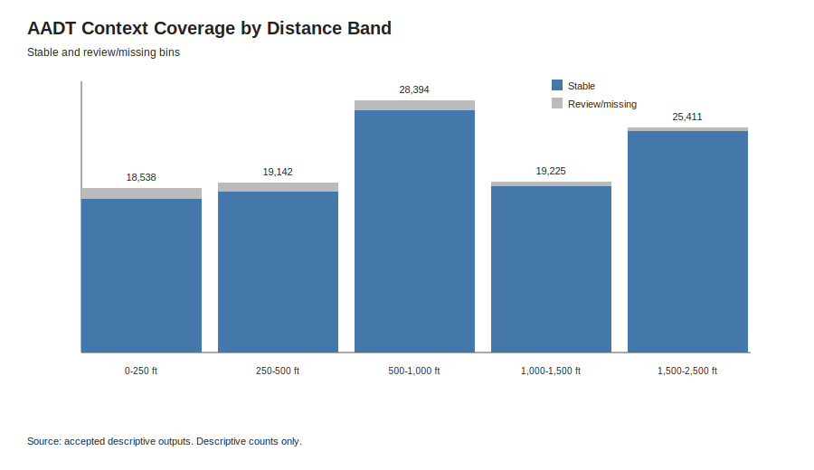

*Exhibit EX09. AADT context coverage by distance band. AADT is summarized as context; only the later aggregate prototype summaries are AADT-normalized.*

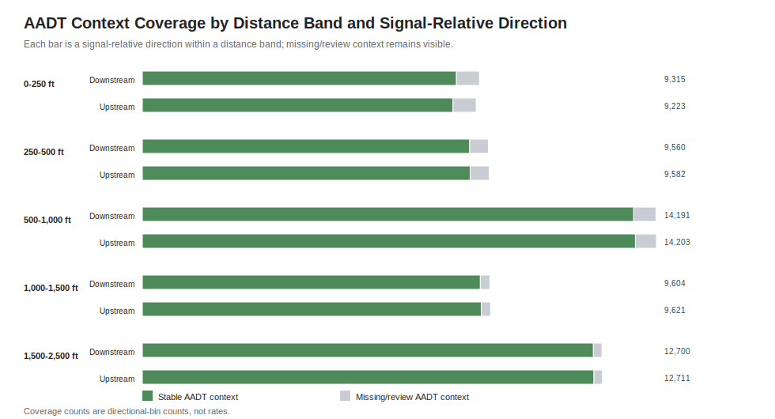

*Exhibit EX09B. AADT context coverage by distance band and signal-relative direction. Missing/review AADT context remains visible.*

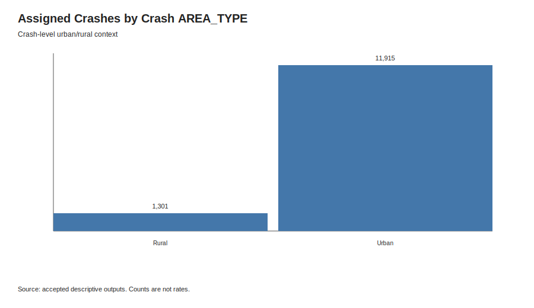

*Exhibit EX10. Assigned crashes by crash-level AREA_TYPE. AREA_TYPE is crash-record context only, not roadway-level urban/rural classification.*

## 6. Descriptive AADT-Normalized Rate Prototype

The AADT-normalized prototype is included as aggregate-only descriptive context because unit-level rates need QA review before any stakeholder unit-rate display. The reviewed unit grain was `reference_signal_id + signal_relative_direction + analysis_window`. All 2,967 unit rows remain QA-only because at least one review condition applied, including low exposure, low crash count, zero crash count, extremely wide exact interval, mixed AADT year, or outside-period AADT year.

The aggregate summaries use exact Poisson/Garwood 95% confidence intervals from `scipy.stats.chi2`. They use estimated vehicle-mile exposure under the approved provisional bidirectional AADT assumption. `DIRECTION_FACTOR` was not applied, missing/review AADT was excluded from denominator values, and crash direction fields were not read or used.

Window-level aggregate summaries:

| Analysis window | Assigned crashes | Estimated vehicle-mile exposure | Crashes per million | Exact 95% CI |
| ---------------- | ---------------- | ----------------- | ----------------------- | ------------ |
| 0-1,000 ft | 8,512 | 7,750,111,561.923209 | 1.098307 | 1.075097 to 1.121891 |
| 1,000-2,500 ft | 3,902 | 4,412,058,113.183136 | 0.884395 | 0.856861 to 0.912588 |

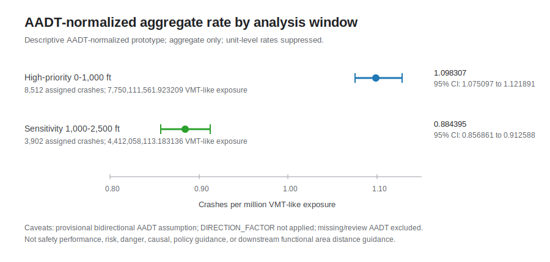

*Exhibit EX13. Descriptive AADT-normalized prototype aggregate window comparison. Aggregate only; unit-level rates remain QA-only; provisional bidirectional AADT assumption; `DIRECTION_FACTOR` not applied; missing/review AADT excluded. Estimated exposure is calculated from AADT, represented roadway length, and the 2022-2024 crash period. This exhibit makes no causal, policy, comparative-performance, or downstream functional area distance interpretation.*

Direction-level aggregate summaries:

| Signal-relative direction | Assigned crashes | Estimated vehicle-mile exposure | Crashes per million | Exact 95% CI |
| ------------------------- | ---------------- | ----------------- | ----------------------- | ------------ |
| downstream_of_reference_signal | 6,288 | 6,102,114,566.998032 | 1.030462 | 1.005148 to 1.056253 |
| upstream_of_reference_signal | 6,126 | 6,060,055,108.108314 | 1.010882 | 0.985725 to 1.036519 |

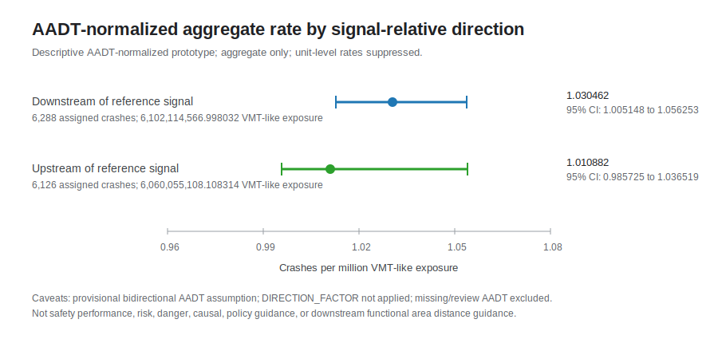

*Exhibit EX14. Descriptive AADT-normalized prototype aggregate direction summary. Aggregate only; unit-level rates remain QA-only; provisional bidirectional AADT assumption; `DIRECTION_FACTOR` not applied; missing/review AADT excluded. Estimated exposure is calculated from AADT, represented roadway length, and the 2022-2024 crash period. This exhibit makes no causal, policy, comparative-performance, or downstream functional area distance interpretation.*

These aggregate summaries are descriptive and provisional. They do not rank sites, directions, or windows; they do not estimate causal effects; and they do not recommend downstream functional area distances. Fixed-band rate sensitivity should wait until the rate display notes and denominator assumptions are manually reviewed and accepted.

## 7. Context Feature Relationship Summaries

The context relationship package is a second report figure set for pre-regression descriptive review. It summarizes how assigned crash counts and, where denominator rules allow, aggregate AADT-normalized prototype rates vary across distance from signal, upstream/downstream direction, posted speed, AADT, access-density context, roadway representation, and crash-level AREA_TYPE context.

These summaries are not a regression/modeling stage and do not prove causality. They are intended to help stakeholders inspect patterns worth reviewing before any modeling design, denominator policy expansion, or fixed-band rate sensitivity work. Count matrices use descriptive assigned-crash counts. Rate matrices use aggregate denominator-ready cells and show denominator warning, sparse cell, or review notes where needed.

Rate display rules for this package:

- assigned crash count >= 20
- estimated vehicle-mile exposure >= 5,000,000
- denominator-ready unit count >= 25
- stable AADT coverage share >= 0.80
- provisional bidirectional AADT assumption retained
- `DIRECTION_FACTOR` not applied
- missing/review AADT excluded from denominator values
- unit-level rates remain QA-only

Estimated exposure is calculated from AADT, represented roadway length, and the 2022-2024 crash period. Direction factors are not applied in this prototype. Rates are not hidden solely because AADT year is outside 2022-2024; those cells are flagged when present.

The package created 185 count/context matrix rows, including roadway representation and crash-level AREA_TYPE context matrices. It evaluated 34 aggregate context-rate cells; 28 cells were display-ready and 6 cells carried denominator, sparse-cell, or review notes. The former context relationship rate display summary is technical QA only and is omitted from this stakeholder-facing report.

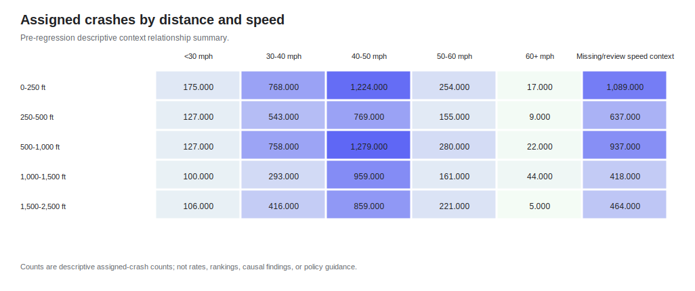

*Exhibit EX15. Pre-regression descriptive assigned-crash count heatmap by distance band and speed band. Speed labels use readable mph categories; missing/review speed context remains visible. Counts are descriptive only and make no causal, policy, comparative-performance, or downstream functional area distance interpretation.*

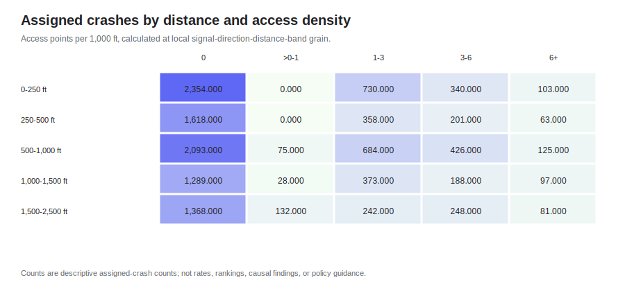

*Exhibit EX16. Pre-regression descriptive assigned-crash count heatmap by distance band and access-density band. Access density is not calculated per 50-ft bin or across the entire displayed group; it is calculated at local reference signal + signal-relative direction + distance-band grain and then summarized. Counts are descriptive only and make no causal, policy, comparative-performance, or downstream functional area distance interpretation.*

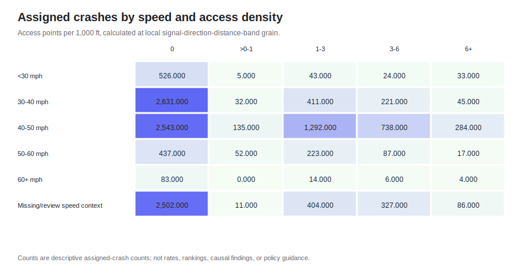

*Exhibit EX17. Pre-regression descriptive assigned-crash count heatmap by speed band and access-density band. Missing/review speed context remains visible. Access density is not calculated per 50-ft bin or across the entire displayed group; it is calculated at local reference signal + signal-relative direction + distance-band grain and then summarized. Counts are descriptive only.*

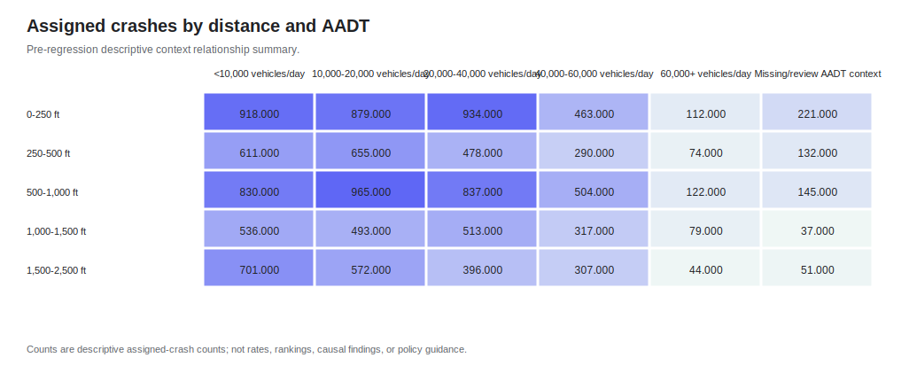

*Exhibit EX18. Pre-regression descriptive assigned-crash count heatmap by distance band and AADT band. AADT labels are vehicles/day. Counts are descriptive only and make no causal, policy, comparative-performance, or downstream functional area distance interpretation.*

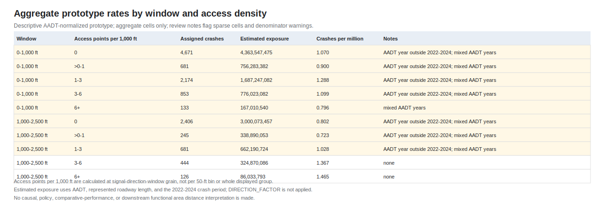

*Exhibit EX19. Descriptive AADT-normalized prototype aggregate rate table by analysis window and access-density band. Aggregate cells only; denominator warning, sparse cell, and review notes are shown; provisional bidirectional AADT assumption; `DIRECTION_FACTOR` not applied; missing/review AADT excluded; unit-level rates remain QA-only. Access density is not calculated per 50-ft bin or across the entire displayed group; it is calculated at reference signal + signal-relative direction + analysis-window grain and then summarized.*

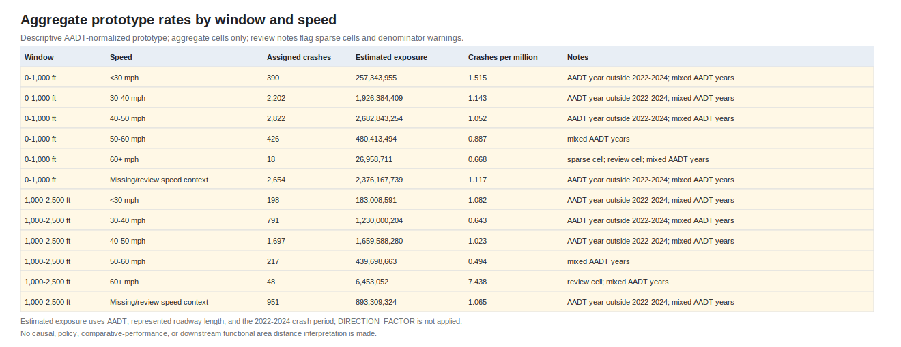

*Exhibit EX20. Descriptive AADT-normalized prototype aggregate rate table by analysis window and speed band. Aggregate cells only; denominator warning, sparse cell, and review notes are shown; provisional bidirectional AADT assumption; `DIRECTION_FACTOR` not applied; missing/review AADT excluded; unit-level rates remain QA-only. Missing/review speed context remains visible.*

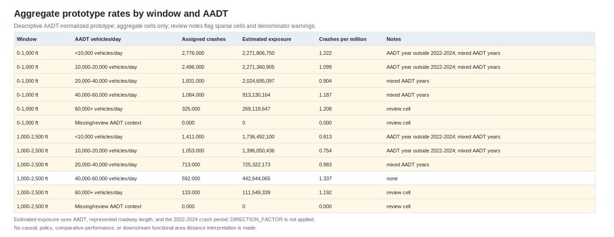

*Exhibit EX21. Descriptive AADT-normalized prototype aggregate rate table by analysis window and AADT band. Aggregate cells only; AADT labels are vehicles/day; denominator warning, sparse cell, and review notes are shown; provisional bidirectional AADT assumption; `DIRECTION_FACTOR` not applied; missing/review AADT excluded; unit-level rates remain QA-only.*

## 8. Descriptive Results

The fixed distance-band summaries show assigned crash counts across five descriptive bands: 0-250 ft, 250-500 ft, 500-1,000 ft, 1,000-1,500 ft, and 1,500-2,500 ft. The first three bands combine to the high-priority 0-1,000 ft window. The final two bands make up the sensitivity window.

This draft reports counts, context completeness, and aggregate-only AADT-normalized prototype summaries. It does not compute new report-stage rates, expose unit-level rates, fit statistical models, or rank locations by performance.

## 9. Signal Review Priority

The signal review queue remains an internal QA and map-review planning product. The copied stakeholder figure package no longer includes the review-priority tier figure or top review-queue table.

## 10. Distance-Band and Signal-Direction Profiles

The signal-direction profile tables are the primary source for later report exhibits at the signal + direction grain. The accepted profile package includes 1,942 signal-direction rows, 3,222 signal-direction-window rows, and 7,797 signal-direction-distance-band rows.

These profiles should be reviewed before selecting case examples or map panels.

## 11. Limitations and Interpretation Cautions

The current report stage has these limits:

- Crash direction fields were not read or used.
- Context fields do not redefine upstream/downstream.
- Rows beyond 2,500 ft are excluded.
- Ambiguous and unresolved crashes remain outside the assigned-crash universe.
- Crash-level AREA_TYPE is not roadway-level urban/rural classification.
- Speed and AADT review/missing statuses remain visible.
- AADT-normalized rates are aggregate-only prototype summaries copied from suppression review outputs.
- Unit-level rates are QA-only and are not included as stakeholder-facing unit-rate tables or figures.
- Context relationship rate tables show aggregate cells with denominator warning, sparse cell, and review notes where needed.
- Fixed distance-band rates and raw bin-level rates were not created.
- Models, regressions, predictions, causal claims, comparative-performance rankings, policy guidance, and design recommendations are not included.

The copied stakeholder figure package no longer includes the context completeness summary figure. Specific speed, AADT, and access context figures remain available above.

## 12. Recommended Next Steps

Recommended next steps:

1. Review this draft report and the figure index.
2. Review EX15 through EX21 first as the main context relationship exhibits for stakeholder discussion.
3. Decide whether selected signals need map review panels.
4. Manually review the aggregate rate exhibit caveats and suppression rules before any broader rate sensitivity work.
5. Keep fixed-band rate sensitivity and modeling/regression work deferred until the suppression rules, denominator assumptions, and uncertainty handling are accepted.

## 13. Appendix / Table and Figure Inventory

The figure index is maintained in `roadway_graph_figure_index.md`. Report QA is maintained in `roadway_graph_report_qa.md`. Stakeholder-safe rate tables are stored under `work/output/roadway_graph/report/current/tables`. The manually refined copied SVG package is stored under `docs/reports/roadway_graph/figures`, with copied overview figure-ready support data under `docs/reports/roadway_graph/figures/figure_data`. Context relationship figure-ready CSV files remain stored under `work/output/roadway_graph/report/current/context_relationship_figure_data`.

